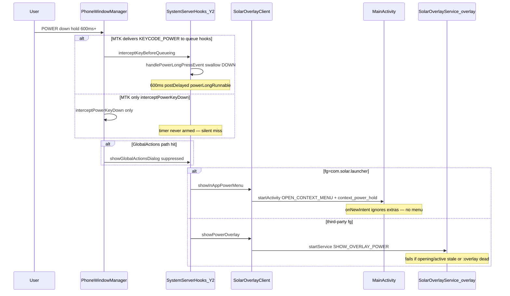

# Solar Global Context Modal + Input Helper — Implementation Plan

**Antigravity artifact** — copy to Antigravity after approval.

**Package:** `SolarGlobalContextModal.apk` / `com.solar.launcher.globalcontext`

**Canonical Companion Track Plan:** [`reference/companion-global-context-track.md`](../reference/companion-global-context-track.md) (canonical architecture & phased breakdown). This document serves as the implementation scratchpad, ROM/build checklist, and Antigravity artifact.

**Complementary track (Solar APK recovery + perf):** [`reference/solar-wide-error-recovery.md`](../reference/solar-wide-error-recovery.md) · [`reference/modular-resilience-contract.md`](../reference/modular-resilience-contract.md) · [`reference/recovery-test-matrix.md`](../reference/recovery-test-matrix.md).

Extract global context overlays, hold-to-rescue HUD/execution, canonical input routing, and self-healing emergency recovery into a **standalone companion APK**. This eliminates `com.solar.launcher` as a Single Point of Failure (SPOF) for system-wide input policy, overlay reliability, and emergency recovery.

**Microservices principle:** Small, low-stakes helper with narrow scope, low crash surface, and **fail-open** behavior (stock keys / root tier-3 when companion is dead). **Master contract:** [`reference/modular-resilience-contract.md`](../reference/modular-resilience-contract.md). Module boundaries: [`reference/companion-global-context-track.md`](../reference/companion-global-context-track.md).

All companion APKs, helper modules, root scripts, and Xposed bridges work in unison with the Solar recovery track — integrated into self-healing, ROM builds, platform prep, and OTA.

### Unison contract with Solar-wide error recovery

| This companion track owns | Solar error-recovery track owns |
|---------------------------|--------------------------------|
| Overlay/rescue/hold/input SPOF (`GlobalInputCoordinatorService`, `RescueExecutor`, `SolarCrashWatchdog`, emergency HOME) | `RockboxRestartGrace`, DB/Reach recovery, `SolarRecoveryCoordinator` (**writes** `crash_streak` on uncaught crash), MainActivity perf split |
| `persist.solar.emergency_mode` **set** after crash loop + reboot | `persist.solar.emergency_mode` **read** at boot; skip heavy Solar bootstrap |
| `sys.solar.overlay.*` **write** after Phase 3 | IME/handoff **read-only** overlay props |
| **`global-input-policy` JAR** (authoritative power/BACK/Rockbox eligibility) | Delegates to JAR after Phase 2b; no duplicate PWM policy |
| `StaleOverlayGate.clearIfNeeded()` before hold arm | Same shared call from `OverlayKeyGate` + bootstrap |

**Sysprop canonical names:** `persist.solar.emergency_mode`, `persist.solar.crash_streak` (not `emergency_rockbox` / `crash_rescue_count`). Solar Phase 1 must **not** ship a second emergency HOME UX once companion Phase 4 is scheduled — forward to companion.

**Power-hold rule:** No tier may swallow POWER/BACK DOWN unless it can deliver modal at 600ms or release for short tap — see Y2 RC1–RC3 below.

---

## Y2 power-hold — root cause and fix

**Expected (Y2):** Per `y1-y2-uniformity.mdc` — long POWER in third-party apps (and Solar) opens the global context modal; stock GlobalActions suppressed; short tap still sleeps/wakes.

### Actual flow today



### Confirmed root causes (ranked)

| ID | Cause | Evidence | Affected |
|----|-------|----------|----------|
| **RC1** | Dead `showInAppPowerMenu` wiring | [`SolarOverlayClient.showInAppPowerMenu`](solar-rom/vendor/xposed/solar-context-bridge/src/SolarOverlayClient.java) → MainActivity with extras MainActivity never reads. PWM swallows POWER DOWN — no in-app fallback. | Y2 Solar HOME |
| **RC2** | Stale overlay gates block power-hold | `handlePowerLongPressEvent` bails when `OverlayKeyForwarder.isOverlayActive()`. Aligns with stuck-overlay (`active=1` without `ui=1`). | All Y2 after partial overlay |
| **RC3** | MTK power path may skip queue hooks | Timer armed only in queue hooks; `interceptPowerKeyDown` afterHook only sets flag — does not arm timer. | Y2 third-party / Rockbox |
| **RC4** | SPOF `:overlay` in Solar package | `showPowerOverlay` → `com.solar.launcher` `:overlay`; force-stop kills host. | Third-party when Solar stopped |
| **RC5** | Root tier fallback gaps | [`GlobalOverlayTriggerMain`](app/src/main/java/com/solar/launcher/GlobalOverlayTriggerMain.java) skips Solar fg; lacks PWM systemui fail-open ([`SystemServerHooks` lines 1215–1218](solar-rom/vendor/xposed/solar-context-bridge/src/SystemServerHooks.java)). | Tier-3 miss only |
| **RC6** | Lab module / wrong bridge | `PowerMenuTest.apk` suppresses GlobalActions without replacement; wrong-family bridge skips Y2 hooks. | Misconfigured only |

**Symptom:** POWER hold on Y2 Solar HOME → activity brought front, no menu. Third-party may fail when RC2+RC3+RC4 combine.

### Y2 adb diagnosis (before/after fix)

```bash
adb shell pm path com.solar.launcher.xposed.bridge.y2
adb shell getprop sys.solar.overlay.active sys.solar.overlay.opening sys.solar.overlay.ui
adb logcat -d | grep -E 'SolarContextBridge|power-long|showPowerOverlay|showInAppPowerMenu|SolarOverlayService'
adb shell ps | grep GlobalOverlayTrigger
```

| Log | Confirms |
|-----|----------|
| `power-long in-app Solar` but no UI | RC1 |
| `skipped overlay opening` | RC2 |
| No power-long hooks | RC6 |
| `startService ok` but no overlay | RC4 |

Lab only: `PowerMenuDebugLog.ENABLED = true` in bridge — re-disable before release.

### Fixes mapped to phases

**Phase 0 — Interim hotfix (ship with Solar recovery P0 + shared `StaleOverlayGate`)**

Targets: [`MainActivity.java`](app/src/main/java/com/solar/launcher/MainActivity.java), [`SystemServerHooks.java`](solar-rom/vendor/xposed/solar-context-bridge/src/SystemServerHooks.java), [`OverlayKeyForwarder.java`](solar-rom/vendor/xposed/solar-context-bridge/src/OverlayKeyForwarder.java), [`OverlayKeyGate.java`](app/src/main/java/com/solar/launcher/OverlayKeyGate.java)

1. **RC1** — Wire `ACTION_OPEN_CONTEXT_MENU` + `EXTRA_CONTEXT_POWER_HOLD` in `onNewIntent`/`onCreate` **or** (preferred) unify Solar fg to `showPowerOverlay` like third-party.
2. **RC2** — Call `StaleOverlayGate.clearIfNeeded()` before `handlePowerLongPressEvent` tracking and before `powerLongRunnable` fires (shared with Solar recovery plan).
3. **RC3** — `interceptPowerKeyDown` beforeHook arms timer; dedupe if queue hook already tracking.
4. **RC5** — Add systemui/null fail-open to [`GlobalOverlayPolicy`](app/src/main/java/com/solar/launcher/GlobalOverlayPolicy.java) to match PWM; move to JAR in Phase 2b.

**Phase 2b / Phase 5 — Structural (companion owns power-hold)**

- [`GlobalInputCoordinatorService`](global-context-modal/) sole Y2 POWER hold FSM.
- Retarget [`SolarOverlayClient.showPowerOverlay`](solar-rom/vendor/xposed/solar-context-bridge/src/SolarOverlayClient.java) → `com.solar.launcher.globalcontext`.
- Deprecate `showInAppPowerMenu` — Solar fg uses companion overlay like every package.
- PWM thin forwarder: `ACTION_HOLD_DOWN` / `ACTION_HOLD_UP` only.

### Phase 6 — Y2 power-hold regression (mandatory)

| Test | Y2 |
|------|-----|
| POWER hold 600ms Solar HOME → modal without lift-off | ✓ |
| POWER hold 600ms third-party → modal | ✓ |
| POWER hold 600ms Rockbox → modal | ✓ |
| After forced stuck `opening=1`, next hold opens modal | ✓ |
| `am force-stop com.solar.launcher` → POWER hold still opens modal (post Phase 2a) | ✓ |
| Stock GlobalActions never on POWER long-hold | ✓ |

Full matrix: [`reference/recovery-test-matrix.md`](../reference/recovery-test-matrix.md).

### Key files

| File | Role |
|------|------|
| [`SystemServerHooks.java`](solar-rom/vendor/xposed/solar-context-bridge/src/SystemServerHooks.java) | Y2 power hooks, `powerLongRunnable`, `handlePowerLongPressEvent` |
| [`SolarOverlayClient.java`](solar-rom/vendor/xposed/solar-context-bridge/src/SolarOverlayClient.java) | `showPowerOverlay`, `showInAppPowerMenu` (broken) |
| [`MainActivity.java`](app/src/main/java/com/solar/launcher/MainActivity.java) | Missing `OPEN_CONTEXT_MENU` handler |
| [`GlobalOverlayTriggerMain.java`](app/src/main/java/com/solar/launcher/GlobalOverlayTriggerMain.java) | Tier-3 `SCAN_POWER` 116 fallback |
| [`OverlayKeyGate.java`](app/src/main/java/com/solar/launcher/OverlayKeyGate.java) | Stale gate self-heal → extract `StaleOverlayGate` |
| [`GlobalOverlayPolicy.java`](app/src/main/java/com/solar/launcher/GlobalOverlayPolicy.java) | Power-hold eligibility → delegate to JAR |

---

## User Review Required

> [!IMPORTANT]
> **Continuous-Hold & Mutex Hierarchy**:
> - **No Lift-Off Modal**: Context modal opens at `CONTEXT_MODAL_MS` (600ms) while the finger is still pressed. Continued holding keeps the modal visible while the rescue countdown runs.
> - **Countdown Timing**: Rescue HUD digits (`3..2..1`) appear only during the final 3 seconds (`RESCUE_COUNTDOWN_START_MS=7000` to `RESCUE_EXECUTE_MS=10000`).
> - **Mutex Hierarchy**: `Global overlay (companion) > IME tray (Solar) > handoff inject > stock delivery`

> [!WARNING]
> **Rockbox Policy & Emergency Mode**:
> - **Normal Rockbox (`org.rockbox`)**: BACK holds under 7s are passed through verbatim to preserve native Rockbox contextual menus. Global context modal is *never* opened over Rockbox unless Solar IME text entry is active (`sys.solar.ime.active=1`).
> - **Emergency Rockbox Mode (`persist.solar.emergency_mode=1`)**: If Solar enters a crash loop and survives an OS reboot without booting, HOME opens an onboarding recovery screen with a fallback **package launcher tier**. In emergency mode on Y1, holding BACK for 2s (`EMERGENCY_ROCKBOX_MODAL_MS`) opens the context modal over Rockbox.
> - **Wheel Handoff**: `MODE_ANDROID` handoff injection is permanently disabled for Rockbox.

> [!CAUTION]
> **ROM Build & On-Device Upgrade Contract**:
> Whenever companion APKs, shared policy JARs, root evdev helpers, or Xposed modules are updated:
> 1. All three ROM build targets (`rom.zip`, `rom_type_b.zip`, `rom_y2.zip`) must include the updated artifacts per `.cursor/rules/y1-y2-rom-parity.mdc`.
> 2. Post-upgrade activation scripts and init keepalives (`99SolarInit.sh`, platform manifest `prepVersion`) must account for service restarts and Xposed module cache invalidation without requiring manual user intervention.
> 3. Audit parity must be verified using `./solar-rom/scripts/audit-device-parity.sh` across Y1 and Y2 hardware over USB ADB.

---

## Proposed Changes

### Phase 0: Stuck Overlay Hotfix + Y2 power tap/hold
**Target**: [SolarOverlayService.java](app/src/main/java/com/solar/launcher/SolarOverlayService.java), [OverlayKeyGate.java](app/src/main/java/com/solar/launcher/OverlayKeyGate.java), [SystemServerHooks.java](solar-rom/vendor/xposed/solar-context-bridge/src/SystemServerHooks.java), [MainActivity.java](app/src/main/java/com/solar/launcher/MainActivity.java)
- Implement paint-or-teardown watchdog to self-heal dim shells in <2s.
- Cap active-without-ui state in `SolarOverlayService` / `OverlayKeyGate`.
- Extract **`StaleOverlayGate.clearIfNeeded()`** — shared with Solar recovery P0 and root daemon.
- **Y2 short POWER tap:** stop consuming `ACTION_DOWN` in `handlePowerLongPressEvent`; let PWM `interceptPowerKeyDown` handle sleep/wake. Consume only after `powerLongFired`.
- **Y2 long POWER hold:** RC1–RC5 interim fixes (see Y2 section above). Prefer `showPowerOverlay` over in-app Activity path.

**Ship together with:** Solar recovery Phase 0 (`RockboxRestartGrace`, theme dedup, `:overlay` health).

### Phase 1: Companion Module Skeleton (`global-context-modal`)
**NEW Module**: `global-context-modal/` (`com.solar.launcher.globalcontext`)
- Create Gradle module containing `GlobalContextOverlayService` (WM modal host) and `RescueHoldService` (7–10s HUD + Restarting flash).
- Add `ThemeReader` with bundled Aura fallback and SD/prefs theme paths.
- Add `GlobalInputPolicy` (lifted from [GlobalOverlayPolicy.java](file:///home/deck/Documents/Cursor%20Workspaces/TheSolarProject/solar/app/src/main/java/com/solar/launcher/GlobalOverlayPolicy.java)).
- Update platform manifest `prepVersion` to 4 in [manifest.json](file:///home/deck/Documents/Cursor%20Workspaces/TheSolarProject/solar/app/src/main/assets/platform/manifest.json).

### Phase 2a: Retarget Xposed Delivery to Companion
**Target**: [SolarOverlayClient.java](file:///home/deck/Documents/Cursor%20Workspaces/TheSolarProject/solar/solar-rom/vendor/xposed/solar-context-bridge/src/SolarOverlayClient.java), [OverlayKeyForwarder.java](file:///home/deck/Documents/Cursor%20Workspaces/TheSolarProject/solar/solar-rom/vendor/xposed/solar-context-bridge/src/OverlayKeyForwarder.java), [SolarRescueHoldClient.java](file:///home/deck/Documents/Cursor%20Workspaces/TheSolarProject/solar/solar-rom/vendor/xposed/solar-context-bridge/src/SolarRescueHoldClient.java), [ActivityOverlayKeyHooks.java](file:///home/deck/Documents/Cursor%20Workspaces/TheSolarProject/solar/solar-rom/vendor/xposed/solar-context-bridge/src/ActivityOverlayKeyHooks.java)
- Retarget target package `SOLAR_PKG` from `com.solar.launcher` to `com.solar.launcher.globalcontext`.

### Phase 2b: Add `GlobalInputCoordinatorService` + Shared Policy JAR
**NEW Files**:
- `global-context-modal/.../GlobalInputCoordinatorService.java`: Sole Y2 POWER hold state machine (600ms modal without lift-off, 7s HUD, 10s rescue, Rockbox BACK passthrough).
- `solar-rom/vendor/global-input-policy/GlobalInputPolicy.java`: **Authoritative** eligibility (~120 lines) — power-hold, BACK-long, Rockbox, IME, rescue, Y2 systemui fail-open. Compiled into Xposed bridge, companion, and Solar (delegate only).
- `solar-rom/vendor/global-input-policy/StaleOverlayGate.java`: sysprop-only stale clear — shared with `OverlayKeyGate`.
**Target**: [SystemServerHooks.java](solar-rom/vendor/xposed/solar-context-bridge/src/SystemServerHooks.java), [GlobalOverlayPolicy.java](app/src/main/java/com/solar/launcher/GlobalOverlayPolicy.java), [GlobalOverlayTriggerMain.java](app/src/main/java/com/solar/launcher/GlobalOverlayTriggerMain.java)
- Replace all duplicated policy methods with JAR calls.
- Delegate hold-gesture FSM from PWM to `GlobalInputCoordinatorService`; PWM becomes thin forwarder.

### Phase 2c: Move Root Daemon to Companion
**Target**: [GlobalOverlayTriggerMain.java](file:///home/deck/Documents/Cursor%20Workspaces/TheSolarProject/solar/app/src/main/java/com/solar/launcher/GlobalOverlayTriggerMain.java) -> Move to `global-context-modal`
- Bootstrap root evdev tier-3 via companion `BootReceiver` (`app_process` with `-cp` pointing to companion APK).
- Update init scripts (`99SolarInit.sh`) and platform prep keepalive targets to start companion host instead of Solar overlay.

### Phase 3: Solar Launcher Slim-down & IPC
**Target**: `app/src/main/AndroidManifest.xml`, [GlobalOverlayPolicy.java](file:///home/deck/Documents/Cursor%20Workspaces/TheSolarProject/solar/app/src/main/java/com/solar/launcher/GlobalOverlayPolicy.java)
- Remove `:overlay` and `:hold` service definitions from main Solar manifest.
- Create `SolarOverlayStateService` binder in Solar to supply live menu rows to companion when alive.
- Deprecate local `GlobalOverlayPolicy` in favor of shared JAR delegation.

### Phase 4: Rescue Escalation + Emergency Rockbox Mode
**NEW Files**:
- `global-context-modal/.../RescueExecutor.java`: Handles 10s hold -> terminate apps -> disable Rockbox if fg (`pm disable org.rockbox`) -> restart Solar -> wait 8s -> clear scoped prefs -> OS reboot.
- `global-context-modal/.../SolarCrashWatchdog.java`: Monitors `com.solar.launcher` process health. **Reads** `persist.solar.crash_streak` (written by Solar coordinator); sets `persist.solar.emergency_mode=1` after OS reboot if crash loop persists; **clears** streak on stable session.
- `global-context-modal/.../EmergencyRockboxMode.java`: In emergency mode, HOME button triggers scrollable onboarding screen ("Solar could not start... report at github.com/thesolarproject/solar") with an OK button that opens a **package launcher tier** (`showPackageLauncherMode()`).
**Target**: [solar-rescue-exec.sh](file:///home/deck/Documents/Cursor%20Workspaces/TheSolarProject/solar/solar-rom/scripts/solar-rescue-exec.sh), [SolarRescueHoldState.java](file:///home/deck/Documents/Cursor%20Workspaces/TheSolarProject/solar/app/src/main/java/com/solar/launcher/SolarRescueHoldState.java), [SolarLauncherSilencer.java](file:///home/deck/Documents/Cursor%20Workspaces/TheSolarProject/solar/solar-rom/vendor/xposed/solar-context-bridge/src/SolarLauncherSilencer.java)
- Update `SolarRescueHoldState` with `RESCUE_COUNTDOWN_START_MS = 7000`.
- Retarget `solar-rescue-exec.sh` and `SolarLauncherSilencer` for companion emergency intercept.

### Phase 5: Unify In-App Foreground Menus Through Companion
**Target**: [MainActivity.java](file:///home/deck/Documents/Cursor%20Workspaces/TheSolarProject/solar/app/src/main/java/com/solar/launcher/MainActivity.java)
- Route foreground power/context menu triggers through companion overlay service.
- Remove legacy `showInAppPowerMenu`.

---

## Verification Plan

### Automated Tests
- Run unit and module integration tests for input policy rules, continuous hold timing, and coordinate mappings:
  ```bash
  ./gradlew :global-context-modal:test
  ./gradlew :app:test
  ```

### Manual Hardware Test Matrix (Y1 & Y2 Parity over USB ADB)
1. **Continuous-Hold UX**: Hold BACK for 600ms in a stock app -> verify modal opens without finger lift-off. Continue holding to 7s -> verify `3..2..1` HUD countdown appears over modal. Hold to 10s -> verify apps terminate and Solar restarts.
2. **Y2 short POWER tap**: Screen on -> single POWER tap -> display sleeps within 500ms. Screen off -> single POWER tap -> display wakes. No GlobalActions dialog.
3. **Y2 POWER long-hold**: Hold POWER 600ms+ -> global context modal opens (Solar HOME, third-party, Rockbox). Short tap still sleeps/wakes after modal dismissed.
4. **Rockbox Normal Passthrough**: In `org.rockbox`, hold BACK for 1s, 3s, and 5s -> verify BACK is passed through verbatim without opening Solar modal. Hold to 7s -> verify countdown HUD appears. Hold to 10s -> verify Rockbox is disabled (`pm disable org.rockbox`) and Solar restarts.
5. **Rockbox IME Text Entry**: Open rename/text field in Rockbox (`sys.solar.ime.active=1`) -> hold BACK (~600ms) -> verify modal opens **above keyboard** and intercepts wheel/BACK until dismissed.
6. **Emergency Rockbox Environment**: Trigger crash streak threshold to set `persist.solar.emergency_mode=1` after reboot -> press HOME -> verify onboarding error message and package launcher tier appear. On Y1, hold BACK for 2s -> verify context modal opens over Rockbox.
7. **ROM Parity & Upgrade Resilience**: Audit ROM builds using `./solar-rom/scripts/audit-device-parity.sh`. Force-stop `com.solar.launcher` (`adb shell am force-stop com.solar.launcher`) -> verify companion overlay, hold gestures, and rescue escalation remain fully operational.
