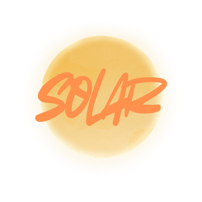
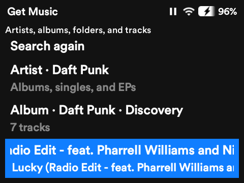
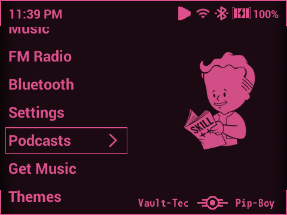

  

# Solar

Custom firmware and launcher for the **Innioasis Y1** — a full interface replacement with podcast downloads, a global quick menu, **Reach** (Deezer + Soulseek), Y1 theme support, and **Rockbox-Y1** on the same ROM (switch without reboot).

## Features

- **Reach** — search, play and download music from Deezer and Soulseek
- **Podcasts** — search and download episodes to your Y1 over the internet
- **Quick menu** — global context menu for playback, queue, Wi‑Fi, Bluetooth, and more from any screen
- **Y1 themes** — install and apply themes from the original Y1 firmware
- **Rockbox-Y1** — co-installed; switch launchers from Settings (unified keymap, no reboot)

## Screenshots

| | |
|:---:|:---:|
|  |  |
| **About Solar** — version, attribution, and OTA update check | **Reach search** — unified Deezer + Soulseek results |
|  |  |
| **Reach browse** — peer library and download actions | **Get Music** — combined Deezer and Reach search |
|  |  |
| **Soulseek messaging** | **Podcasts** — subscribe and browse shows |
|  |  |
| **Podcast episodes** — episode list and downloads | **Artists view** — music library by artist > album |
|  |  |
| **Quick controls** — global context menu (playback, queue, Wi‑Fi) | **ACmp3 theme** — Y1 custom theme applied in Solar |

## Deezer account setup

Reach and **Get Music** can search, stream, and download from [Deezer](https://www.deezer.com) using your account’s **`arl` session cookie** (the same method used by other Deezer download tools). You need a free or Premium Deezer account and a PC on the **same Wi‑Fi** as the Y1.

### On the Y1

1. Open **Settings → Deezer**.
2. Turn **Deezer** on.
3. Turn **Include in Get Music** on if you want Deezer results in the home **Get Music** search (alongside Reach).
4. Select **Set up on PC**. Solar starts a small setup server and shows a URL like `http://192.168.x.x:8080/deezer`.

### On your PC

1. In a browser, open the URL shown on the Y1 (**use the Y1’s IP** — not `localhost`).
2. In another tab, log in at [deezer.com/login](https://www.deezer.com/login) if you are not already signed in.
3. Copy your **`arl` cookie** from the browser:
   - **Chrome:** `F12` → **Application** → **Cookies** → `https://www.deezer.com` → copy the **arl** value (long hex string).
   - **Firefox:** `F12` → **Storage** → **Cookies** → `https://www.deezer.com` → **arl**.
4. On the Solar setup page, paste **arl**, choose **MP3** or **FLAC (Premium)**, and tap **Save & Test**.
5. Wait for **Deezer login verified** before closing the page.

### Back on the Y1

1. Press **Back** to leave the setup screen (confirm **I'm finished** if asked).
2. Try **Get Music** from the home menu, or **Settings → Deezer → Search**, and download or queue a track.

### Notes

- Treat **arl** like a password — only paste it on the setup page on your home network.
- If **arl** is missing in DevTools, refresh deezer.com while logged in, or sign out and back in.
- Some test builds ship with a shared demo account; paste your own **arl** to replace it.
- To switch accounts or quality later: **Settings → Deezer → Set up on PC** again.
- **FLAC** requires Deezer Premium; free accounts should use **MP3**.
